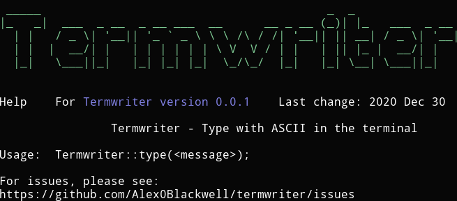

<h1 align="center">Termwriter</h1>

  

  <a href="#overview">Overview</a>
  &nbsp;&nbsp;&nbsp;|&nbsp;&nbsp;&nbsp;
  <a href="#examples">Examples</a>
  &nbsp;&nbsp;&nbsp;|&nbsp;&nbsp;&nbsp;
  <a href="#usage">Usage</a>

## Overview
Type with ASCII in the terminal with this library! Adding Termwriter typing is an easy way to make the help, documentation, or README of your C++ project stand out. Download the `termwriter.hpp` file from the GitHub [**Releases tab**](https://github.com/Alex0Blackwell/termwriter/releases) and include it in your project!

## Examples

> Improve the appearance of the help page

  

## Usage

Adding ASCII typing is as easy as including the file and using the type function.

    #include "termwriter.hpp"
    ...
    Termwriter::type(<message>);

Where the message is any combination of keys on an English keyboard!

Get Termwriter up and running on your own C++ project in minutes by downloading the [*termwriter.hpp file*](https://github.com/Alex0Blackwell/termwriter/releases/download/0.0.1/termwriter.hpp)
